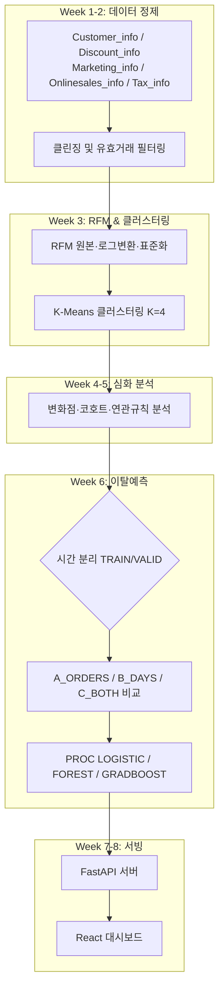
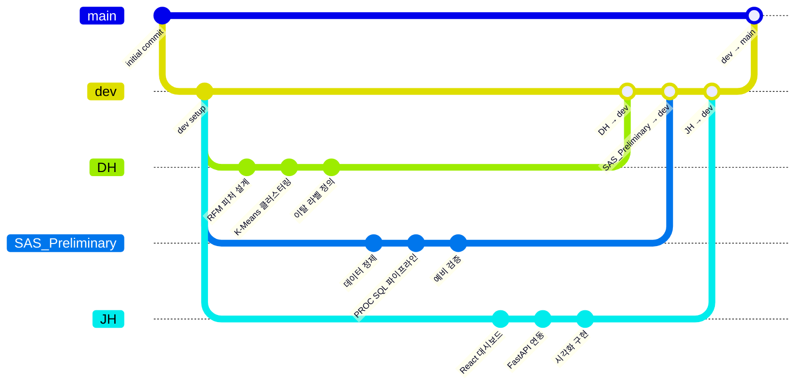

# crm_pj

https://rfm-proje.github.io/crm_pj/git-flow-detailed-rendered.html


# 📊 CRM Insight Hub: RFM 기반 고객 세그멘테이션 및 이탈예측 CRM 분석 플랫폼

[](https://www.sas.com/)
[](https://www.python.org/)
[](https://scikit-learn.org/)
[](https://react.dev/)
[](https://fastapi.tiangolo.com/)

---

## 📋 목차

1. [프로젝트 개요 및 기획 배경](#1-프로젝트-개요-및-기획-배경)
2. [팀 구성 및 역할](#2-팀-구성-및-역할)
3. [상세 기술 스택](#3-상세-기술-스택)
4. [시스템 아키텍처 및 파이프라인](#4-시스템-아키텍처-및-파이프라인)
5. [🔥 핵심 난관 및 해결 과정 (Troubleshooting)](#5-핵심-난관-및-해결-과정-troubleshooting)
6. [프로젝트 한계 및 향후 발전 방향](#6-프로젝트-한계-및-향후-발전-방향)
7. [디렉토리 구조](#7-디렉토리-구조)
8. [브랜치 전략 및 협업 방식](#8-브랜치-전략-및-협업-방식)
9. [설치 및 실행 방법](#9-설치-및-실행-방법)

---

## 1. 📝 프로젝트 개요 및 기획 배경

**"어떤 고객이 곧 떠날 것인가, 그리고 왜 떠나는가?"**

CRM 담당자가 매일 마주하는 질문이지만, 실제로는 "이탈"이라는 개념 자체가 라벨링 방식에 따라 완전히 다르게 정의될 수 있다는 함정이 있습니다. 본 프로젝트는 DACON 이커머스 데이터셋을 기반으로, RFM 세그멘테이션과 이탈예측 모형을 SAS Viya 파이프라인으로 구축하고, 그 결과를 React + FastAPI 대시보드로 서비스하는 것을 목표로 합니다.

단순히 "정확도 높은 모형을 만드는 것"에 그치지 않고, **이탈 라벨 정의의 정보 누출을 발견해 수정하고, 신규 고객 구간에서 모형이 왜 무너지는지 구조적으로 규명**하는 과정 자체를 프로젝트의 핵심 산출물로 다룹니다.

---

## 2. 👥 팀 구성 및 역할

| 이름 | 역할 | 주 담당 업무 |
| --- | --- | --- |
| **skybluewindy** | **총괄 & 대시보드** | RFM 피처 설계, K-Means 클러스터링, 이탈예측 모형(A/B/C 비교), 시각화 |
| **eogks1235-byte** | **모델링 & 대시보드** | Git 연동 및 모델 비교 실험 공동 진행, 진단·검증 파이프라인, 시각화 |

*(SAS_Preliminary는 SAS 예비 파이프라인 작업 브랜치입니다 — 브랜치 전략 참고)*

---

## 3. 🛠 상세 기술 스택

### 데이터 · 모델링

- **SAS Viya**: `PROC SQL`, `PROC PYTHON`, `PROC LOGISTIC`, `PROC FOREST`, `PROC GRADBOOST`, `PROC SGPLOT`
- **Python (SAS Viya `PROC PYTHON` 내)**: pandas, numpy, scikit-learn (LogisticRegression, RandomForestClassifier, GradientBoostingClassifier), scipy.stats
- **RFM 세그멘테이션**: Recency / Frequency / Monetary 로그변환 + 표준화, K-Means (K=4, LOG_FM 버전)
- **이탈예측**: 시간 분리(TRAIN/VALID) 기반 로지스틱 회귀 및 트리 앙상블 비교, 부트스트랩 신뢰구간 기반 모형 선택

### 대시보드

- **Backend**: FastAPI
- **Frontend**: React

### 진단 · 검증 도구

- VIF(분산팽창지수), PSI(Population Stability Index), KS 검정, 부트스트랩 AUC 신뢰구간

---

## 4. ⚙️ 시스템 아키텍처 및 파이프라인

8주 파이프라인으로 구성되어 있으며, 데이터 정제부터 대시보드 서빙까지 이어집니다.



---

## 5. 🔥 핵심 난관 및 해결 과정 (Troubleshooting)

본 프로젝트의 핵심 난관은 "정확한 모형을 만드는 것"이 아니라, **"모형이 특정 구간(신규 고객)에서만 실패하는 이유를 구조적으로 규명하는 것"** 이었습니다. 단순히 파라미터를 튜닝하는 대신, **가설 수립 → 반증 → 재가설**의 반복을 통해 원인을 좁혀나갔습니다.

---

### Hurdle 1. 이탈 라벨의 정보 누출(Data Leakage) 발견

초기 이탈 정의는 `Recency > 90일`(전체 기간 기준)이었습니다. 그러나 이 방식은 피처 계산에 사용된 기간과 라벨 계산 기간이 겹쳐, **미래 정보가 과거 피처로 역류하는 leakage**를 유발한다는 것이 확인되었습니다.

이를 해결하기 위해 **시간 분리(temporal-split) 기반 churn 정의**로 전면 교체했습니다. TRAIN 기준일(2019-06-30)과 VALID 기준일(2019-10-02)을 명확히 분리하고, 각 기준일 이전 데이터로만 피처를 계산하도록 파이프라인을 재구성했습니다.

---

### Hurdle 2. Frequency 정의에 따른 A/B/C 모형 비교

`frequency_orders`(주문 수)와 `frequency_days`(구매일수) 중 어느 것이 더 안정적인 신호인지 확인하기 위해, 공통 피처 + 세 가지 Frequency 정의(A_ORDERS / B_DAYS / C_BOTH)로 로지스틱 회귀 모형을 병렬 비교했습니다.

VALID AUC 기준 B_DAYS(0.671)가 A_ORDERS(0.653)보다 부트스트랩 95% 신뢰구간 하한이 0을 넘는 유의한 개선을 보였고, C_BOTH는 B_DAYS 대비 추가 개선이 미미해 **B_DAYS를 최종 채택**했습니다.

---

### Hurdle 3. VALID_NEW(신규 고객) 구간에서의 성능 붕괴

TRAIN/VALID에서는 AUC 0.65~0.68 수준이던 모형이, **TRAIN에 없던 신규 고객(VALID_NEW, 311명) 구간에서는 AUC가 0.55 근처(거의 랜덤 수준)로 붕괴**했습니다. 겉보기 accuracy·recall은 오히려 높았는데, 이는 이 구간의 이탈율(81%)이 워낙 높아 "거의 다 이탈로 예측"해도 맞는 비율이 높아지는 착시였습니다(balanced_accuracy는 실제로 0.50 근처).

원인을 좁히기 위해 다음 가설들을 순서대로 검증하고 기각했습니다.

- **가설 A: 90일 관측 윈도우가 너무 짧다** → 기각. 전체 고객 중 평균 재구매 간격이 90일을 넘는 비율은 6.5%에 불과해, 윈도우를 늘려도 이탈율에 미치는 영향은 미미했습니다.
- **가설 B: 단건구매(1회 주문) 고객 비중이 너무 크다** → 기각. 단건구매 고객은 전체의 10.1%뿐으로, 72.5%에 달하는 이탈율을 설명하기엔 부족했습니다. 오히려 이탈 고객의 88%가 2회 이상 구매 이력이 있는 고객이었습니다.
- **가설 C: 관측기간(observation window) 자체의 구조적 절단** → **일부 확인**. VALID_NEW 고객의 평균 관측기간은 49일로 TRAIN(97일)의 절반 수준이었고, 100%가 정의상 94일 이내로 제한됩니다. 다만 관측기간으로 정규화한 `recency_ratio`를 KS 검정으로 비교한 결과, TRAIN과 VALID_NEW 분포가 통계적으로 유의하게 달랐습니다(p<0.001) — 즉 **구조적 절단 효과와 신규 고객의 실제 초기 이탈 경향(early churn)이 함께 작용**하고 있다는 결론에 도달했습니다.

---

### Hurdle 4. Threshold 튜닝의 한계

VALID_NEW의 붕괴가 threshold=0.5 고정 때문일 가능성을 검증하기 위해, F1 최대화·balanced_accuracy 최대화·base rate 세 가지 방식으로 threshold를 재탐색했습니다. balanced_accuracy 최대화 방식이 가장 나았지만 개선폭은 +0.02~0.03 수준(0.50 → 0.53)에 그쳤습니다. threshold는 ROC 커브 위의 한 점을 고르는 것일 뿐, AUC 자체(판별력의 상한)를 바꾸지는 못하기 때문입니다.

---

### Hurdle 5. 피처 엔지니어링과 다중공선성

"모형이 관측기간을 직접 알게 하면 되지 않을까"라는 아이디어로 `recency_ratio`(관측기간 대비 상대 recency), `observation_days`, `is_short_window` 세 피처를 추가했지만, VALID_NEW AUC는 오히려 소폭 하락했습니다.

VIF(분산팽창지수)로 원인을 확인한 결과, `observation_days`(VIF=25.9), `recency`(VIF=25.8)가 SEVERE 수준으로 나타났습니다 — 새 피처들이 기존 `recency`와 거의 같은 정보를 중복 제공하면서, 로지스틱 회귀의 계수가 여러 피처에 불안정하게 흩어진 것이었습니다.

---

### Hurdle 6. 다중공선성에 자유로운 트리 모형으로도 재검증

다중공선성 문제가 없는 RandomForest·GradientBoosting으로 같은 피처셋을 재검증했습니다. 그러나 FULL 피처셋(vs BASE)의 VALID_NEW AUC 차이는 모든 조합에서 부트스트랩 95% 신뢰구간이 0을 포함해 **통계적으로 유의한 개선을 확인하지 못했습니다.** 이는 다중공선성이 문제의 전부가 아니라, 신규 피처 자체가 담고 있는 독립적인 정보량이 애초에 제한적이었다는 것을 의미합니다.

---

### 결론

VALID_NEW 구간의 성능 한계는 **threshold, 피처, 알고리즘 어느 것으로도 해소되지 않는 구조적 한계**로 확인되었습니다. 근본 원인은 신규 고객의 관측기간이 짧아 발생하는 정보 부족(cold-start)이며, 이는 모델링으로 극복할 문제가 아니라 **운영 정책으로 다뤄야 할 문제**라는 결론에 도달했습니다.

---

## 6. 🚧 프로젝트 한계 및 향후 발전 방향

### 현재 한계

- **신규 고객(cold-start) 예측 한계**: 관측기간이 짧은 고객에 대해서는 AUC 0.55 내외로, 사실상 유의미한 판별력을 기대하기 어렵습니다.
- **거래 로그 중심 피처**: RFM류 피처만으로는 "왜 이탈하는지"에 대한 설명력이 제한적입니다. 고객센터 문의, 앱 체류시간, 마케팅 반응률 같은 행동 신호가 없습니다.
- **표본 크기**: TRAIN 900명 규모로, 복잡한 모형(트리 앙상블)은 과적합에 취약했습니다(GradientBoosting TRAIN AUC 0.91 vs VALID_NEW AUC 0.55).

### 향후 발전 방향

1. **이원화 운영 정책**: 기존 고객은 모형 기반 우선순위 스코어링, 신규 고객(`is_short_window=1`)은 룰 기반 임시 관리로 분리.
2. **ROI 손익분기 분석**: 캠페인 비용·성공률은 데이터만으로 알 수 없으므로, 절대 ROI 대신 "어떤 비용·전환율 조건에서 이득인지"를 보여주는 민감도 분석 제공.
3. **비정형 데이터 결합**: 고객센터 로그, 이메일/푸시 반응 데이터를 추가해 cold-start 문제를 완화.
4. **재학습 주기 도입**: 신규 고객이 충분한 관측기간을 확보하는 시점마다 재평가하는 롤링 재학습 구조.

---

## 7. 📂 디렉토리 구조

```
📦 CRM Insight Hub (crm_pj)
 ┣ 📂 SAS/                                      # SAS Viya 파이프라인 스크립트
 ┃ ┣ 📜 3.1-A_RFM_준비.sas                        # RFM 원본·로그변환·표준화
 ┃ ┣ 📜 3.1-B_K_비교.sas                          # K-Means 군집 수 비교
 ┃ ┣ 📜 WBS_3.2-A_FREQUENCY_ABC_INPUT.sas         # Frequency 정의 비교용 피처 생성
 ┃ ┣ 📜 WBS_3.2-B_재구매주기_진단.sas               # 관측 윈도우 가설 검증
 ┃ ┣ 📜 WBS_3.2-C_단건구매_진단.sas                 # 단건구매 고객 가설 검증
 ┃ ┣ 📜 WBS_3.3-A_FREQUENCY_ABC_COMPARE.sas       # A/B/C 모형 비교
 ┃ ┣ 📜 WBS_3.3-B_THRESHOLD_TUNING.sas            # Threshold 튜닝
 ┃ ┣ 📜 WBS_3.3-C_PSI_DRIFT_CHECK.sas             # 피처 드리프트(PSI) 진단
 ┃ ┣ 📜 WBS_3.3-D_TRUNCATION_PROOF.sas            # 관측기간 구조적 절단 검증
 ┃ ┣ 📜 WBS_3.3-E_WINDOW_FEATURE_RETRAIN.sas      # 관측기간 정규화 피처 재학습
 ┃ ┣ 📜 WBS_3.3-F_TREE_MODEL_COMPARE.sas          # 트리 모형 비교
 ┃ ┗ 📜 WBS_3.3-G_VIF_CHECK.sas                   # 다중공선성(VIF) 진단
 ┣ 📂 dashboard-frontend/                        # React 대시보드
 ┣ 📂 dashboard-backend/                         # FastAPI 서버
 ┣ 📜 LICENSE
 ┗ 📜 README.md
```

---

## 8. 🔀 브랜치 전략 및 협업 방식

Feature Branch 기반의 3단계 Git Flow(`feature → dev → main`)를 따릅니다. SAS Studio ↔ GitHub Git 연동을 통해 팀원과 동기화합니다.



### 커밋 컨벤션

| 태그 | 용도 |
| --- | --- |
| `feat:` | 새 기능/피처 추가 |
| `fix:` | 버그 수정 |
| `refactor:` | 코드 구조 개선 (동작 변화 없음) |
| `docs:` | 문서·주석만 변경 |
| `data:` | 데이터 파이프라인·테이블 변경 |

---

## 9. 🚀 설치 및 실행 방법

### SAS Viya 파이프라인 실행

```bash
# SAS Studio에서 순서대로 실행
# 1) RFM 준비 및 클러스터링
3.1-A_RFM_준비.sas
3.1-B_K_비교.sas

# 2) Frequency 정의 비교 및 모형 선택
WBS_3.2-A_FREQUENCY_ABC_INPUT.sas
WBS_3.3-A_FREQUENCY_ABC_COMPARE.sas

# 3) 진단(선택) — VALID_NEW 성능 원인 규명이 필요할 때
WBS_3.2-B_재구매주기_진단.sas
WBS_3.2-C_단건구매_진단.sas
WBS_3.3-D_TRUNCATION_PROOF.sas
WBS_3.3-G_VIF_CHECK.sas
```

### 대시보드 실행

```bash
# Backend (FastAPI)
cd dashboard-backend
pip install -r requirements.txt
python main.py

# Frontend (React)
cd dashboard-frontend
npm install
npm run dev
```
