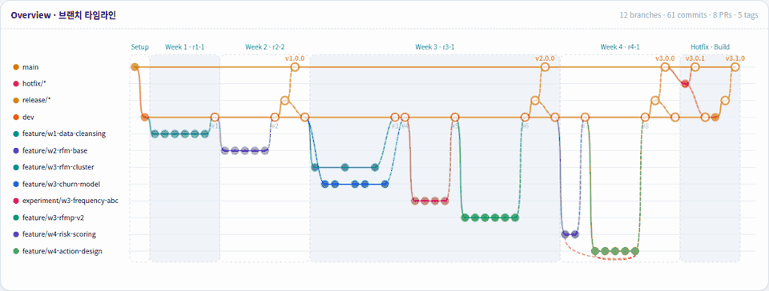
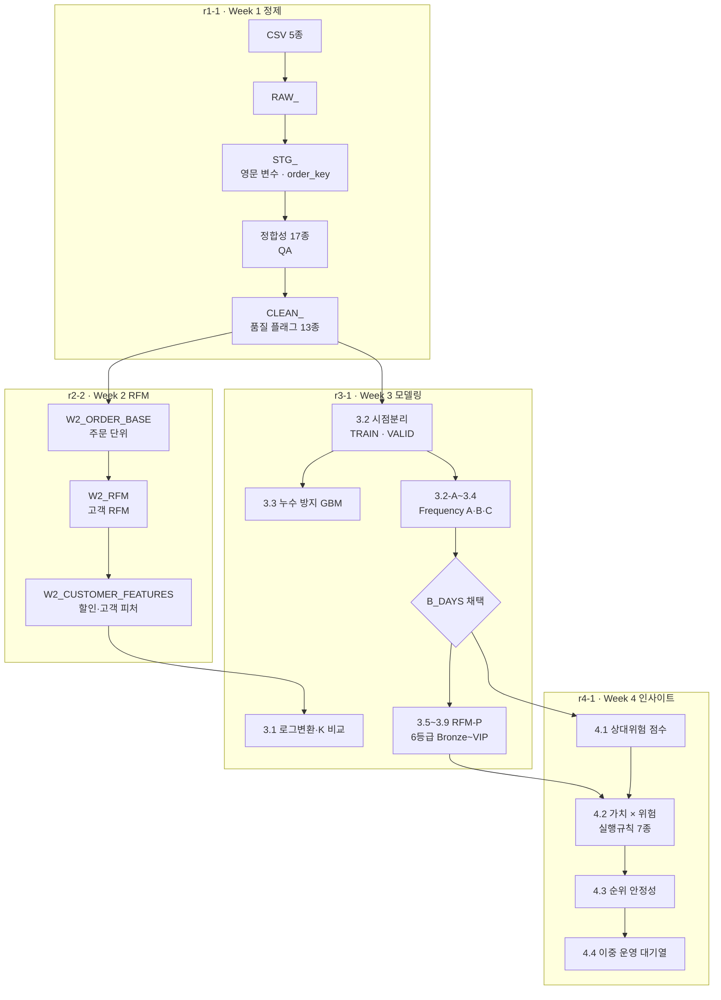
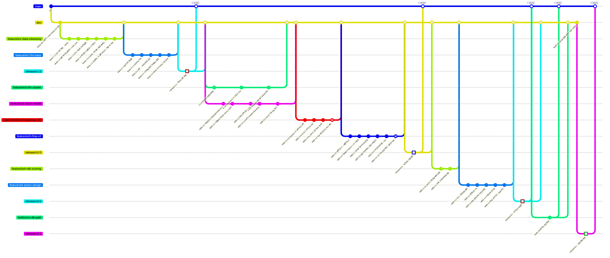

[README.md](https://github.com/user-attachments/files/32837268/README.md)


# 📊 CRM Insight Hub
### RFM-P 고객가치 × 이탈 상대위험으로 "누구를, 어떻게 먼저 관리할지" 정하는 SAS CRM 분석 파이프라인

[](https://www.sas.com/)
[](https://www.python.org/)
[](https://scikit-learn.org/)
[](#git-flow)

<a href="https://rfm-proje.github.io/crm_pj/git-flow-detailed-rendered.html">
  
</a>

👆 **[인터랙티브 Git Flow 열기](https://rfm-proje.github.io/crm_pj/git-flow-detailed-rendered.html)** — 커밋을 누르면 단계별 작업 내용과 산출 테이블을 볼 수 있습니다.

---

## ⚡ 30초 요약

| | 내용 |
| --- | --- |
| **문제** | 이커머스 고객 1,468명 중 누가 곧 떠날지, 떠나면 손실이 큰 고객은 누구인지 알 수 없음 |
| **데이터** | DACON 이커머스 5개 테이블 (고객 · 온라인 거래 · 할인 · 마케팅 · 세금), 2019년 1년치 |
| **방법** | ① 거래 정제·품질 플래그 → ② 주문·고객 단위 RFM → ③ 시점분리 이탈 모형 + 구매일 기준 **RFM-P** 6등급 → ④ 가치 × 상대위험 매핑과 실행규칙 |
| **핵심 결정** | Frequency를 주문 수가 아닌 **구매일 수(B_DAYS)** 로 정의 — VALID AUC 0.653 → **0.671**, 부트스트랩 CI 하한 > 0 |
| **결과물** | 고객별 가치등급 · 상대위험등급 · 실행규칙 7종 · 가치보호/위험관리 **이중 운영 대기열**(50·100·200명) |
| **정직한 한계** | TRAIN에 없던 신규 고객(311명)은 AUC ≈ 0.55 → 모델이 아닌 **운영 정책**(저비용 반응 확인)으로 관리 |
| **재현** | `run_all.sas` 한 번으로 r1-1 → r4-1 전체 실행 + 파일별 PDF 리포트 4개 |

---

## 📋 목차

1. [프로젝트 개요 및 기획 배경](#overview)
2. [팀 구성 및 역할](#team)
3. [분석 파이프라인 (r1-1 → r4-1)](#pipeline)
4. [핵심 결과](#results)
5. [핵심 난관 및 해결 과정](#troubleshooting)
6. [한계 및 향후 발전 방향](#limits)
7. [디렉토리 구조](#structure)
8. [브랜치 전략 및 협업 방식](#git-flow)
9. [실행 방법](#run)

---

<a name="overview"></a>

## 1. 📝 프로젝트 개요 및 기획 배경

**"어떤 고객이 곧 떠날 것인가, 그리고 그중 누구를 먼저 붙잡아야 하는가?"**

CRM 담당자가 매일 마주하는 질문이지만, "이탈"은 라벨을 어떻게 정의하느냐에 따라 완전히 다른 답이 나옵니다. 본 프로젝트는 DACON 이커머스 데이터셋으로 SAS Viya 파이프라인을 구축해, **고객가치(RFM-P)** 와 **이탈 상대위험**을 따로 측정한 뒤 둘을 결합해 실행 가능한 운영 명단을 만듭니다.

단순히 정확도 높은 모형을 만드는 데 그치지 않고, 다음 과정 자체를 핵심 산출물로 다룹니다.

- 이탈 라벨의 **정보 누출(leakage)** 을 발견하고 시점분리 방식으로 재설계
- Frequency 정의를 **A·B·C 실험**으로 비교해 근거를 갖고 선택
- 신규 고객 구간에서 모형이 **왜 무너지는지** 구조적으로 규명하고, 모델 대신 운영 정책으로 대응
- 모든 단계에 **QA 게이트**(검증 실패 시 삭제 대신 중단)를 두어 재실행해도 같은 결과가 나오도록 설계

---

<a name="team"></a>

## 2. 👥 팀 구성 및 역할

| 이름 | 역할 | 주 담당 업무 |
| --- | --- | --- |
| **skybluewindy** | **총괄 & 대시보드** | RFM 피처 설계, K-Means 클러스터링, 이탈예측 모형(A/B/C 비교), 시각화 |
| **eogks1235-byte** | **모델링 & 대시보드** | Git 연동 및 모델 비교 실험 공동 진행, 진단·검증 파이프라인, 시각화 |

---

<a name="pipeline"></a>

## 3. ⚙️ 분석 파이프라인 (r1-1 → r4-1)

4개 SAS 파일이 앞 단계의 결과 테이블을 입력으로 받아 순서대로 이어집니다.


```mermaid
flowchart TD
    subgraph R1["r1-1 · Week 1 정제"]
        A[CSV 5종] --> B[RAW_] --> C[STG_<br>영문 변수 · order_key] --> D[정합성 17종<br>QA] --> E[CLEAN_<br>품질 플래그 13종]
    end
    subgraph R2["r2-2 · Week 2 RFM"]
        E --> F[W2_ORDER_BASE<br>주문 단위] --> G[W2_RFM<br>고객 RFM] --> H[W2_CUSTOMER_FEATURES<br>할인·고객 피처]
    end
    subgraph R3["r3-1 · Week 3 모델링"]
        H --> I[3.1 로그변환·K 비교]
        E --> J[3.2 시점분리<br>TRAIN · VALID] --> K[3.3 누수 방지 GBM]
        J --> L[3.2-A~3.4<br>Frequency A·B·C] --> M{B_DAYS 채택}
        M --> N[3.5~3.9 RFM-P<br>6등급 Bronze~VIP]
    end
    subgraph R4["r4-1 · Week 4 인사이트"]
        M --> O[4.1 상대위험 점수]
        N --> P[4.2 가치 × 위험<br>실행규칙 7종]
        O --> P --> Q[4.3 순위 안정성] --> R[4.4 이중 운영 대기열]
    end
```

| 파일 | 단계 | 하는 일 | 주요 산출 테이블 |
| --- | --- | --- | --- |
| `r1-1.sas` | Week 1-1 ~ 1-5 | CSV 적재 → 영문 표준화 → 프로파일링 → 정합성 17종 → 정제·품질 플래그 (이상치·반품은 삭제하지 않고 플래그) | `CLEAN_ONLINE` 외 4종, `QA_INTEGRITY_SUMMARY`, `QA_FLAG_SUMMARY` |
| `r2-2.sas` | Week 2-1 ~ 2-3 | 상품 행 → 주문 단위 (배송료 1회 반영) → 고객 RFM → 할인 파생변수 결합, PROC PYTHON EDA | `W2_ORDER_BASE`, `W2_RFM`, `W2_CUSTOMER_FEATURES` |
| `r3-1.sas` | WBS 3.1 ~ 3.9 | 로그변환·표준화, 시점분리 이탈 라벨, 누수 방지 모형, Frequency A·B·C 실험, 구매일 기준 RFM-P 재산출 | `W3_CHURN_SPLIT_V2`, `W3_FREQUENCY_POLICY`, `W3_CUSTOMER_RFMP_PY`, `W3_CUSTOMER_ANALYTIC_BASE_PY` |
| `r4-1.sas` | WBS 4.1 ~ 4.4 | B_DAYS 모형 재현·상대위험 점수 → 가치 × 위험 매핑 → 순위 안정성 검증 → 이중 운영 대기열과 종료 판단 | `W4_41_CURRENT_SCORED`, `W4_42_CUSTOMER_ACTION`, `W4_44_FINAL_ROSTER` |
| `run_all.sas` | 전체 | 4개 파일 순차 실행 + 파일별 결과 PDF 저장 | `r1-1_result.pdf` ~ `r4-1_result.pdf` |

### 설계 원칙

- **식별자**: 거래ID가 여러 고객에게 재사용되므로 주문 키는 `order_key = 고객ID | 거래ID`
- **시점분리**: TRAIN은 2019-06-30까지의 행동으로 이후 90일 이탈을, VALID는 2019-10-02까지로 이후 90일 이탈을 예측
- **가치와 위험 분리**: RFM-P는 "얼마나 중요한 고객인가", 이탈모형은 "얼마나 떠날 것 같은가"를 따로 측정
- **확률보다 순위**: 예측확률이 실제 이탈률보다 낮게 나와 절대확률 대신 **상대위험 순위**만 사용
- **QA 게이트**: 각 단계 끝에 PASS / REVIEW / FAIL 판정, FAIL이면 `%abort`로 중단

---

<a name="results"></a>

## 4. 📈 핵심 결과

### ① Frequency 정의: 주문 수 대신 구매일 수

| 모형 | Frequency 정의 | VALID AUC | 판정 |
| --- | --- | --- | --- |
| A_ORDERS | 주문 수 | 0.653 | 기준 |
| **B_DAYS** | **서로 다른 구매일 수** | **0.671** | **채택** — B−A 부트스트랩 95% CI 하한 > 0 |
| C_BOTH | 둘 다 | B와 비슷 | 추가 개선 미미 |

`frequency_days`는 WBS 3.4의 6개 게이트(QA 0건 · 중복 0건 · 자동 권고 · AUC 우위 · CI 하한 > 0 · Brier 비악화)를 통과해 공식 Frequency가 되었고, 이후 RFM-P 등급도 이 정의로 다시 계산했습니다.

### ② RFM-P 고객가치 6등급

- 지표별 K-means(R=3 · F=4 · M=2 · P=4) → 군집 변동계수(CV)의 역수로 가중치 산정
- 가중 점수를 6분위로 나눠 **Bronze · Silver · Gold · Platinum · Diamond · VIP**
- P(제품가치)는 카테고리별 구매일 수 × 평균단가로 계산해 "비싼 카테고리를 자주 사는 고객"을 반영

### ③ 가치 × 상대위험 실행규칙

| 규칙 | 대상 | 실행 |
| --- | --- | --- |
| NEW_LOW_COST_TEST | 구매 이력 90일 미만 신규 고객 | 고비용 혜택 없이 대표 카테고리 반응 확인 |
| HIGH_VALUE_RETENTION | High 위험 · VIP/Diamond | 개별 유지 제안 우선 검토 |
| TARGETED_RETENTION | High 위험 · Platinum/Gold | 대표 카테고리 중심 제한적 맞춤 혜택 |
| LOW_COST_REACTIVATION | High 위험 · 그 외 | 자동 알림 중심 저비용 재활성화 |
| LOYALTY_CROSSSELL | Medium 위험 · VIP/Diamond | 대표 카테고리 기반 교차판매 |
| CATEGORY_REMINDER | Medium 위험 · 그 외 | 개인 대표 카테고리 리마인드 |
| MAINTAIN_MONITOR | Low 위험 | 과도한 할인 없이 관계 유지 |

### ④ 이중 운영 대기열 (WBS 4.4)

- **VALUE_PROTECTION**: 가치 백분위 × 위험 백분위가 큰 순 → 손실이 큰 고객부터 보호
- **RISK_PREVENTION**: 순수 위험 순위 → 떠날 가능성이 큰 고객에게 저비용 조치
- 각 대기열 상위 **50 · 100 · 200명**을 시험 운영 규모로 표시
- 4.3 검증: 공식 점수와 50:50 대안 점수의 상위 대상 중복률 ≥ 70% → 순위 **STABLE**
- 최종 판단 `CLOSE_WBS4_PILOT_READY` — 소규모 시험 운영 준비 완료 (ROI는 대조군 실험 전까지 확정하지 않음)

---

<a name="troubleshooting"></a>

## 5. 🔥 핵심 난관 및 해결 과정 (Troubleshooting)

본 프로젝트의 핵심 난관은 "정확한 모형을 만드는 것"이 아니라, **"모형이 특정 구간(신규 고객)에서만 실패하는 이유를 구조적으로 규명하는 것"** 이었습니다. 단순히 파라미터를 튜닝하는 대신, **가설 수립 → 반증 → 재가설**의 반복을 통해 원인을 좁혀나갔습니다.

---

### Hurdle 1. 이탈 라벨의 정보 누출(Data Leakage) 발견

초기 이탈 정의는 `Recency > 90일`(전체 기간 기준)이었습니다. 그러나 이 방식은 피처 계산에 사용된 기간과 라벨 계산 기간이 겹쳐, **미래 정보가 과거 피처로 역류하는 leakage**를 유발한다는 것이 확인되었습니다.

이를 해결하기 위해 **시간 분리(temporal-split) 기반 churn 정의**로 전면 교체했습니다. TRAIN 기준일(2019-06-30)과 VALID 기준일(2019-10-02)을 명확히 분리하고, 각 기준일 이전 데이터로만 피처를 계산하도록 파이프라인을 재구성했습니다.

---

### Hurdle 2. Frequency 정의에 따른 A/B/C 모형 비교

`frequency_orders`(주문 수)와 `frequency_days`(구매일수) 중 어느 것이 더 안정적인 신호인지 확인하기 위해, 공통 피처 + 세 가지 Frequency 정의(A_ORDERS / B_DAYS / C_BOTH)로 로지스틱 회귀 모형을 병렬 비교했습니다.

VALID AUC 기준 B_DAYS(0.671)가 A_ORDERS(0.653)보다 부트스트랩 95% 신뢰구간 하한이 0을 넘는 유의한 개선을 보였고, C_BOTH는 B_DAYS 대비 추가 개선이 미미해 **B_DAYS를 최종 채택**했습니다.

---

### Hurdle 3. VALID_NEW(신규 고객) 구간에서의 성능 붕괴

TRAIN/VALID에서는 AUC 0.65~0.68 수준이던 모형이, **TRAIN에 없던 신규 고객(VALID_NEW, 311명) 구간에서는 AUC가 0.55 근처(거의 랜덤 수준)로 붕괴**했습니다. 겉보기 accuracy·recall은 오히려 높았는데, 이는 이 구간의 이탈율(81%)이 워낙 높아 "거의 다 이탈로 예측"해도 맞는 비율이 높아지는 착시였습니다(balanced_accuracy는 실제로 0.50 근처).

원인을 좁히기 위해 다음 가설들을 순서대로 검증하고 기각했습니다.

- **가설 A: 90일 관측 윈도우가 너무 짧다** → 기각. 전체 고객 중 평균 재구매 간격이 90일을 넘는 비율은 6.5%에 불과해, 윈도우를 늘려도 이탈율에 미치는 영향은 미미했습니다.
- **가설 B: 단건구매(1회 주문) 고객 비중이 너무 크다** → 기각. 단건구매 고객은 전체의 10.1%뿐으로, 72.5%에 달하는 이탈율을 설명하기엔 부족했습니다. 오히려 이탈 고객의 88%가 2회 이상 구매 이력이 있는 고객이었습니다.
- **가설 C: 관측기간(observation window) 자체의 구조적 절단** → **일부 확인**. VALID_NEW 고객의 평균 관측기간은 49일로 TRAIN(97일)의 절반 수준이었고, 100%가 정의상 94일 이내로 제한됩니다. 다만 관측기간으로 정규화한 `recency_ratio`를 KS 검정으로 비교한 결과, TRAIN과 VALID_NEW 분포가 통계적으로 유의하게 달랐습니다(p<0.001) — 즉 **구조적 절단 효과와 신규 고객의 실제 초기 이탈 경향(early churn)이 함께 작용**하고 있다는 결론에 도달했습니다.

---

### Hurdle 4. Threshold 튜닝의 한계

VALID_NEW의 붕괴가 threshold=0.5 고정 때문일 가능성을 검증하기 위해, F1 최대화·balanced_accuracy 최대화·base rate 세 가지 방식으로 threshold를 재탐색했습니다. balanced_accuracy 최대화 방식이 가장 나았지만 개선폭은 +0.02~0.03 수준(0.50 → 0.53)에 그쳤습니다. threshold는 ROC 커브 위의 한 점을 고르는 것일 뿐, AUC 자체(판별력의 상한)를 바꾸지는 못하기 때문입니다.

---

### Hurdle 5. 피처 엔지니어링과 다중공선성

"모형이 관측기간을 직접 알게 하면 되지 않을까"라는 아이디어로 `recency_ratio`(관측기간 대비 상대 recency), `observation_days`, `is_short_window` 세 피처를 추가했지만, VALID_NEW AUC는 오히려 소폭 하락했습니다.

VIF(분산팽창지수)로 원인을 확인한 결과, `observation_days`(VIF=25.9), `recency`(VIF=25.8)가 SEVERE 수준으로 나타났습니다 — 새 피처들이 기존 `recency`와 거의 같은 정보를 중복 제공하면서, 로지스틱 회귀의 계수가 여러 피처에 불안정하게 흩어진 것이었습니다.

---

### Hurdle 6. 다중공선성에 자유로운 트리 모형으로도 재검증

다중공선성 문제가 없는 RandomForest·GradientBoosting으로 같은 피처셋을 재검증했습니다. 그러나 FULL 피처셋(vs BASE)의 VALID_NEW AUC 차이는 모든 조합에서 부트스트랩 95% 신뢰구간이 0을 포함해 **통계적으로 유의한 개선을 확인하지 못했습니다.** 이는 다중공선성이 문제의 전부가 아니라, 신규 피처 자체가 담고 있는 독립적인 정보량이 애초에 제한적이었다는 것을 의미합니다.

---

### Hurdle 7. 가치와 위험이 같은 정보를 공유하는 문제

RFM-P(가치)와 이탈모형(위험)은 둘 다 `recency` · `frequency_days` · `monetary`를 사용합니다. 두 점수를 곱해 우선순위를 만들면 같은 정보가 두 번 반영될 수 있어, WBS 4.3에서 공통 변수의 선형효과를 제거한 **잔차 Spearman 상관**과 원 상관을 비교하고, 곱셈 점수와 50:50 평균 점수의 **상위 50·100·200명 중복률**을 확인했습니다. 중복률이 기준(70%)을 넘어 현재 우선순위를 유지하되, 두 점수가 완전히 독립적이지 않다는 점은 인사이트 표의 "한계"에 명시했습니다.

---

### Hurdle 8. 재실행할 때마다 결과가 달라질 위험

조인 키가 중복되면 거래 행이 조용히 불어나고, 중간 실패 시 이전 결과와 새 결과가 섞일 수 있습니다. 그래서 모든 단계를 **"WORK에서 후보 생성 → 검증 → 통과 시에만 CRM에 저장"** 구조로 바꾸고(예: 1-5 키 중복 게이트, 3.1-B 14행 검증), 검증 실패 시 데이터를 지우는 대신 `%abort`로 멈추도록 했습니다. 마지막으로 `run_all.sas`로 전체를 한 번에 재실행해 PDF로 결과를 남깁니다.

---

### 결론

VALID_NEW 구간의 성능 한계는 **threshold, 피처, 알고리즘 어느 것으로도 해소되지 않는 구조적 한계**로 확인되었습니다. 근본 원인은 신규 고객의 관측기간이 짧아 발생하는 정보 부족(cold-start)이며, 이는 모델링으로 극복할 문제가 아니라 **운영 정책으로 다뤄야 할 문제**라는 결론에 도달했습니다.

---


<a name="limits"></a>

## 6. 🚧 한계 및 향후 발전 방향

### 현재 한계

- **신규 고객(cold-start)**: 관측기간이 짧은 고객은 AUC 0.55 내외로 판별력이 거의 없습니다 → 실행규칙 1번(저비용 반응 확인)으로만 관리합니다.
- **확률 보정 미완료**: 평균 예측확률이 실제 이탈률보다 낮아 절대 이탈확률로 해석할 수 없습니다. 현재는 상대 순위만 사용합니다.
- **고객 단위 독립 검증 아님**: TRAIN과 VALID에 같은 고객이 포함될 수 있어, 결과는 시험 운영 대상 선정에만 사용합니다.
- **거래 로그 중심 피처**: 고객센터 문의, 앱 체류시간, 캠페인 반응 같은 행동 신호가 없어 "왜 떠나는지"에 대한 설명력이 제한적입니다.

### 향후 발전 방향

1. **대조군 실험**: 두 대기열을 소규모로 운영하고 대조군과 비교해 실제 반응률 · 비용 · 증분가치(ROI)를 측정
2. **확률 보정**: Platt scaling / isotonic 보정 후 절대확률 기반 기준선 검토
3. **롤링 재학습**: 신규 고객이 충분한 관측기간을 확보하는 시점마다 재평가
4. **대시보드**: 고객별 등급 · 위험 · 실행규칙을 조회하는 React + FastAPI 화면

---

<a name="structure"></a>

## 7. 📂 디렉토리 구조

```
📦 crm_pj
 ┣ 📂 sas/
 ┃ ┣ 📜 r1-1.sas            # Week 1  CSV 적재 · 표준화 · 정합성 · 정제
 ┃ ┣ 📜 r2-2.sas            # Week 2  주문 단위 · RFM · 고객 피처 · EDA
 ┃ ┣ 📜 r3-1.sas            # Week 3  군집 · 이탈모형 · Frequency 실험 · RFM-P
 ┃ ┣ 📜 r4-1.sas            # Week 4  상대위험 · 실행규칙 · 안정성 · 운영 대기열
 ┃ ┗ 📜 run_all.sas         # 4개 파일 일괄 실행 + PDF 리포트
 ┣ 📜 git-flow-detailed-rendered.html   # 인터랙티브 Git Flow (GitHub Pages)
 ┣ 📜 git-flow-demo-light.gif           # README 상단 애니메이션
 ┣ 📜 LICENSE
 ┗ 📜 README.md
```

---

<a name="git-flow"></a>

## 8. 🔀 브랜치 전략 및 협업 방식

[인터랙티브 Git Flow](https://rfm-proje.github.io/crm_pj/git-flow-detailed-rendered.html)에서 커밋별 작업 내용과 산출 테이블을 확인할 수 있습니다.

Git Flow(`feature → dev → release → main`, 긴급 수정은 `hotfix → main`)를 따르며, 마지막 `run_all.sas`까지 `release/v3.1`을 거쳐 `main`에 배포했습니다. 기능 브랜치는 SAS 파일(r1-1 · r2-2 · r3-1 · r4-1)의 WBS 작업 단위로 나누고, `dev`에는 PR로만 병합합니다. SAS Studio ↔ GitHub Git 연동으로 팀원과 동기화합니다.

| 브랜치 | 갈라진 곳 | 병합 대상 | 커밋 | 역할 |
| --- | --- | --- | --- | --- |
| `main` | — | — | 6 | 배포 가능한 산출물만 올라가는 브랜치. 릴리스 태그가 붙습니다. |
| `hotfix/*` | `main` | `main`, `dev` | 1 | main에서 바로 따서 고치는 긴급 수정 브랜치. |
| `release/*` | `dev` | `main`, `dev` | 4 | dev를 동결하고 전 단계 재실행·QA를 확인하는 릴리스 브랜치. |
| `dev` | `main` | — | 14 | 모든 기능 브랜치가 PR로 모이는 통합 브랜치. |
| `feature/w1-data-cleansing` | `dev` | `dev` | 6 | r1-1.sas · Week 1-1~1-5 CSV 적재부터 CLEAN_ 테이블까지. |
| `feature/w2-rfm-base` | `dev` | `dev` | 5 | r2-2.sas · Week 2-1~2-3 주문·고객 RFM과 고객 피처. |
| `feature/w3-rfm-cluster` | `dev` | `dev` | 3 | r3-1.sas · 3.1-A/B 로그변환·표준화와 K 비교. |
| `feature/w3-churn-model` | `dev` | `dev` | 5 | r3-1.sas · WBS 3.2~3.3 시점분리 이탈 라벨과 누수 방지 모형. |
| `experiment/w3-frequency-abc` | `dev` | `dev` | 4 | r3-1.sas · WBS 3.2-A~3.4 Frequency 정의 A·B·C 실험. |
| `feature/w3-rfmp-v2` | `dev` | `dev` | 6 | r3-1.sas · WBS 3.5~3.9 구매일 기준 RFM-P 재산출. |
| `feature/w4-risk-scoring` | `dev` | `dev` | 2 | r4-1.sas · WBS 4.1 B_DAYS 기준모형 검증과 상대위험 점수. |
| `feature/w4-action-design` | `dev` | `dev` | 5 | r4-1.sas · WBS 4.2~4.4 가치×위험 실행규칙과 운영 대기열. |

### 전체 흐름


```mermaid
gitGraph
    commit id: "init"
    branch dev
    commit id: "Setup dev 브랜치 + SAS Studio Git 연동"
    branch feature/w1-data-cleansing
    commit id: "Week 1-1 CSV 5종 적재 → RAW_"
    commit id: "Week 1-2 영문 변수명 표준화 + order_key"
    commit id: "Week 1-3 STG 데이터 프로파일링"
    commit id: "Week 1-4 테이블 간 정합성 17개 검사"
    commit id: "Week 1-5 CLEAN_ 테이블 + 품질 플래그"
    commit id: "Week 1-5 안전장치: 키 중복 게이트 + 검증 후 저장"
    checkout dev
    merge feature/w1-data-cleansing
    branch feature/w2-rfm-base
    commit id: "Week 2-1 주문 단위 테이블"
    commit id: "Week 2-2 고객 RFM 지표"
    commit id: "Week 2-2 주문 ↔ RFM 합계 검산"
    commit id: "Week 2-3 고객정보·할인 파생변수 결합"
    commit id: "Week 2-3 PROC PYTHON 고객 EDA"
    checkout dev
    merge feature/w2-rfm-base
    branch release/v1.0
    commit id: "release/v1.0 · 데이터 마트 동결" type: HIGHLIGHT
    checkout main
    merge release/v1.0 tag: "v1.0.0"
    checkout dev
    merge release/v1.0
    branch feature/w3-rfm-cluster
    commit id: "3.1-A RFM 로그변환·표준화"
    checkout dev
    branch feature/w3-churn-model
    commit id: "WBS 3.2 이탈 윈도우 30/60/90/120일 비교"
    commit id: "WBS 3.2 시점분리 TRAIN·VALID 스냅샷"
    checkout feature/w3-rfm-cluster
    commit id: "3.1-B K=2~8 군집 수 비교"
    checkout feature/w3-churn-model
    commit id: "WBS 3.2 확장 피처 6종 + QA"
    commit id: "WBS 3.3 누수 방지 Gradient Boosting"
    checkout feature/w3-rfm-cluster
    commit id: "3.1-B K=4를 참고 후보로 강등"
    checkout feature/w3-churn-model
    commit id: "WBS 3.3 VALID 기준 성능 평가"
    checkout dev
    merge feature/w3-rfm-cluster
    merge feature/w3-churn-model
    branch experiment/w3-frequency-abc
    commit id: "WBS 3.2-A Frequency 두 정의 비교 피처"
    commit id: "WBS 3.3-A A·B·C 로지스틱 비교"
    commit id: "WBS 3.4 B_DAYS 공식 후보 게이트"
    commit id: "WBS 3.4 '%p' 매크로 오인 경고 제거" type: REVERSE
    checkout dev
    merge experiment/w3-frequency-abc
    branch feature/w3-rfmp-v2
    commit id: "WBS 3.5 전체기간 F + 제품가치 P"
    commit id: "WBS 3.6 지표별 K-means + CV 가중치"
    commit id: "WBS 3.7 RFMP 점수와 6개 등급"
    commit id: "WBS 3.8 등급 프로파일 + 대표 카테고리"
    commit id: "WBS 3.9 고객 분석 테이블 + QA"
    commit id: "WBS 3.5~3.9 누락 본문 복원 + 매크로 순서" type: REVERSE
    checkout dev
    merge feature/w3-rfmp-v2
    branch release/v2.0
    commit id: "release/v2.0 · 세그먼트·이탈모형" type: HIGHLIGHT
    checkout main
    merge release/v2.0 tag: "v2.0.0"
    checkout dev
    merge release/v2.0
    branch feature/w4-risk-scoring
    commit id: "WBS 4.1 B_DAYS 기준모형 재현·검증"
    commit id: "WBS 4.1 전체 고객 상대위험 점수"
    checkout dev
    merge feature/w4-risk-scoring
    branch feature/w4-action-design
    commit id: "WBS 4.2 가치 × 상대위험 매핑"
    commit id: "WBS 4.2 실행규칙 7개"
    commit id: "WBS 4.3 정보 중복·순위 안정성 검증"
    commit id: "WBS 4.4 이중 운영 대기열"
    commit id: "WBS 4.4 핵심 인사이트 + 종료 판단"
    checkout dev
    merge feature/w4-action-design
    branch release/v3.0
    commit id: "release/v3.0 · 인사이트·파일럿" type: HIGHLIGHT
    checkout main
    merge release/v3.0 tag: "v3.0.0"
    checkout dev
    merge release/v3.0
    checkout main
    branch hotfix/crm-db-path
    commit id: "Hotfix 라이브러리 경로 통일"
    checkout main
    merge hotfix/crm-db-path tag: "v3.0.1"
    checkout dev
    merge hotfix/crm-db-path
    commit id: "Build run_all.sas 일괄 실행 + PDF 리포트"
    branch release/v3.1
    commit id: "release/v3.1 · 일괄 실행 배포" type: HIGHLIGHT
    checkout main
    merge release/v3.1 tag: "v3.1.0"
```

### 릴리스 기준

| 태그 | 포함 범위 | 릴리스 전 확인 |
| --- | --- | --- |
| `v1.0.0` | r1-1, r2-2 · RAW → STG → CLEAN → W2 데이터 마트 | CLEAN_ONLINE 행 수 = STG_ONLINE, 주문↔RFM 합계 차이 0 |
| `v2.0.0` | r3-1 · 3.1 ~ 3.9 세그먼트·이탈모형·RFMP | 3.4 B_DAYS 게이트 6개 통과, RFMP QA FAIL 0 |
| `v3.0.0` | r4-1 · 4.1 ~ 4.4 상대위험·실행규칙·운영 대기열 | 4.4 판단 `CLOSE_WBS4_PILOT_READY` |
| `v3.0.1` | hotfix · 라이브러리 경로 `crm_db1 → crm_db` 통일 | 로직 변경 없음 |
| `v3.1.0` | `run_all.sas` 일괄 실행 + 파일별 PDF 리포트 | PDF 4개(`r1-1` ~ `r4-1_result.pdf`) 생성 |

4.4의 판단이 `RETURN_TO_4_1` 또는 `RETURN_TO_4_2_4_3`이면 해당 단계로 돌아가 재실행한 뒤 다시 PR을 올립니다.

### 커밋 컨벤션

| 태그 | 용도 | 예시 |
| --- | --- | --- |
| `feat:` | 새 분석 단계·테이블 추가 | `feat(w3-3.3A): A_ORDERS · B_DAYS · C_BOTH 로지스틱 비교` |
| `fix:` | 오류 수정 | `fix(w3-3.4): '3 퍼센트포인트' 매크로 오인 경고 제거` |
| `refactor:` | 결과는 같고 구조·안전장치 개선 | `refactor(w1-5): 조인 전 키 중복 게이트` |
| `test:` | 검산·안정성 검증 | `test(w2-2): Frequency·Monetary 합계 차이 0 검산` |
| `build:` | 실행 스크립트·리포트 | `build: run_all.sas 추가` |
| `docs:` | 문서·주석만 변경 | `docs: README 브랜치 전략 갱신` |
| `chore:` | 설정·경로 등 기타 | `chore(dev): SAS Studio Git 연동` |

---

<a name="run"></a>

## 9. 🚀 실행 방법

### 사전 준비

1. SAS Studio(SAS Viya)에 DACON CSV 5종(`Customer_info`, `Onlinesales_info`, `Discount_info`, `Marketing_info`, `Tax_info`)을 올립니다.
2. `r1-1.sas`의 `CSV_DIR`과 각 파일의 `libname crm` / `%let CRM_PATH` 경로를 본인 환경에 맞춥니다. (기본값 `/home/student/crm_db`)

### 한 번에 실행 (권장)

`run_all.sas` 상단의 경로 두 줄만 고친 뒤 전체 실행(F3)합니다.

```sas
%let CODE_DIR=/home/student/crm_code;   /* r1-1 ~ r4-1.sas 가 있는 폴더 */
%let PDF_PARENT=/home/student;
%let PDF_NAME=abcdefg;                  /* PDF 저장 폴더 */
```

- 실행 순서: `r1-1 → r2-2 → r3-1 → r4-1`
- 결과: `/home/student/abcdefg/r1-1_result.pdf` ~ `r4-1_result.pdf` (표 · 그래프)
- 각 파일의 코드를 고쳐도 `run_all.sas`는 다시 만들 필요가 없습니다 (`%include`가 실행 시점의 파일을 읽음).
- 중간 단계의 QA가 FAIL이면 `%abort`로 멈추므로 LOG에서 원인을 먼저 확인합니다.

### 단계별 실행

같은 순서로 `r1-1.sas` → `r2-2.sas` → `r3-1.sas` → `r4-1.sas`를 하나씩 실행해도 됩니다. 각 파일은 시작할 때 필요한 입력 테이블이 있는지 확인합니다.
