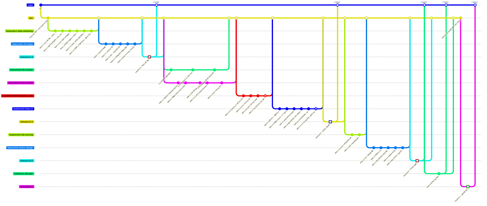

## 8. 🔀 브랜치 전략 및 협업 방식

<a href="https://rfm-proje.github.io/crm_pj/git-flow-detailed-rendered.html">
  <picture>
    <source media="(prefers-color-scheme: dark)" srcset="./git-flow-demo-dark.gif">
    
  </picture>
</a>

👆 클릭하면 커밋마다 작업 내용·산출 테이블을 볼 수 있는 [인터랙티브 Git Flow](https://rfm-proje.github.io/crm_pj/git-flow-detailed-rendered.html)로 이동합니다.

Git Flow(`feature → dev → release → main`, 긴급 수정은 `hotfix → main`)를 따르며, 마지막 `run_all.sas`까지 `release/v3.1`을 거쳐 `main`에 배포했습니다. 기능 브랜치는 SAS 파일(r1-1 · r2-2 · r3-1 · r4-1)의 WBS 작업 단위로 나누고, `dev`에는 PR로만 병합합니다. SAS Studio ↔ GitHub Git 연동으로 팀원과 동기화합니다.

| 브랜치 | 갈라진 곳 | 병합 대상 | 커밋 | 역할 |
| --- | --- | --- | --- | --- |
| `main` | — | — | 6 | 배포 가능한 산출물만 올라가는 브랜치. 릴리스 태그가 붙습니다. |
| `hotfix/*` | `main` | `main`, `dev` | 1 | main에서 바로 따서 고치는 긴급 수정 브랜치. |
| `release/*` | `dev` | `main`, `dev` | 4 | dev를 동결하고 전 단계 재실행·QA를 확인하는 릴리스 브랜치. |
| `dev` | `main` | — | 14 | 모든 기능 브랜치가 PR로 모이는 통합 브랜치. |
| `feature/w1-data-cleansing` | `dev` | `dev` | 6 | r1-1.sas · Week 1-1~1-5 CSV 적재부터 CLEAN_ 테이블까지. |
| `feature/w2-rfm-base` | `dev` | `dev` | 5 | r2-2.sas · Week 2-1~2-3 주문·고객 RFM과 고객 피처. |
| `feature/w3-rfm-cluster` | `dev` | `dev` | 3 | r3-1.sas · 3.1-A/B 로그변환·표준화와 K 비교. |
| `feature/w3-churn-model` | `dev` | `dev` | 5 | r3-1.sas · WBS 3.2~3.3 시점분리 이탈 라벨과 누수 방지 모형. |
| `experiment/w3-frequency-abc` | `dev` | `dev` | 4 | r3-1.sas · WBS 3.2-A~3.4 Frequency 정의 A·B·C 실험. |
| `feature/w3-rfmp-v2` | `dev` | `dev` | 6 | r3-1.sas · WBS 3.5~3.9 구매일 기준 RFM-P 재산출. |
| `feature/w4-risk-scoring` | `dev` | `dev` | 2 | r4-1.sas · WBS 4.1 B_DAYS 기준모형 검증과 상대위험 점수. |
| `feature/w4-action-design` | `dev` | `dev` | 5 | r4-1.sas · WBS 4.2~4.4 가치×위험 실행규칙과 운영 대기열. |

### 전체 흐름

```mermaid
gitGraph
    commit id: "init"
    branch dev
    commit id: "Setup dev 브랜치 + SAS Studio Git 연동"
    branch feature/w1-data-cleansing
    commit id: "Week 1-1 CSV 5종 적재 → RAW_"
    commit id: "Week 1-2 영문 변수명 표준화 + order_key"
    commit id: "Week 1-3 STG 데이터 프로파일링"
    commit id: "Week 1-4 테이블 간 정합성 17개 검사"
    commit id: "Week 1-5 CLEAN_ 테이블 + 품질 플래그"
    commit id: "Week 1-5 안전장치: 키 중복 게이트 + 검증 후 저장"
    checkout dev
    merge feature/w1-data-cleansing
    branch feature/w2-rfm-base
    commit id: "Week 2-1 주문 단위 테이블"
    commit id: "Week 2-2 고객 RFM 지표"
    commit id: "Week 2-2 주문 ↔ RFM 합계 검산"
    commit id: "Week 2-3 고객정보·할인 파생변수 결합"
    commit id: "Week 2-3 PROC PYTHON 고객 EDA"
    checkout dev
    merge feature/w2-rfm-base
    branch release/v1.0
    commit id: "release/v1.0 · 데이터 마트 동결" type: HIGHLIGHT
    checkout main
    merge release/v1.0 tag: "v1.0.0"
    checkout dev
    merge release/v1.0
    branch feature/w3-rfm-cluster
    commit id: "3.1-A RFM 로그변환·표준화"
    checkout dev
    branch feature/w3-churn-model
    commit id: "WBS 3.2 이탈 윈도우 30/60/90/120일 비교"
    commit id: "WBS 3.2 시점분리 TRAIN·VALID 스냅샷"
    checkout feature/w3-rfm-cluster
    commit id: "3.1-B K=2~8 군집 수 비교"
    checkout feature/w3-churn-model
    commit id: "WBS 3.2 확장 피처 6종 + QA"
    commit id: "WBS 3.3 누수 방지 Gradient Boosting"
    checkout feature/w3-rfm-cluster
    commit id: "3.1-B K=4를 참고 후보로 강등"
    checkout feature/w3-churn-model
    commit id: "WBS 3.3 VALID 기준 성능 평가"
    checkout dev
    merge feature/w3-rfm-cluster
    merge feature/w3-churn-model
    branch experiment/w3-frequency-abc
    commit id: "WBS 3.2-A Frequency 두 정의 비교 피처"
    commit id: "WBS 3.3-A A·B·C 로지스틱 비교"
    commit id: "WBS 3.4 B_DAYS 공식 후보 게이트"
    commit id: "WBS 3.4 '%p' 매크로 오인 경고 제거" type: REVERSE
    checkout dev
    merge experiment/w3-frequency-abc
    branch feature/w3-rfmp-v2
    commit id: "WBS 3.5 전체기간 F + 제품가치 P"
    commit id: "WBS 3.6 지표별 K-means + CV 가중치"
    commit id: "WBS 3.7 RFMP 점수와 6개 등급"
    commit id: "WBS 3.8 등급 프로파일 + 대표 카테고리"
    commit id: "WBS 3.9 고객 분석 테이블 + QA"
    commit id: "WBS 3.5~3.9 누락 본문 복원 + 매크로 순서" type: REVERSE
    checkout dev
    merge feature/w3-rfmp-v2
    branch release/v2.0
    commit id: "release/v2.0 · 세그먼트·이탈모형" type: HIGHLIGHT
    checkout main
    merge release/v2.0 tag: "v2.0.0"
    checkout dev
    merge release/v2.0
    branch feature/w4-risk-scoring
    commit id: "WBS 4.1 B_DAYS 기준모형 재현·검증"
    commit id: "WBS 4.1 전체 고객 상대위험 점수"
    checkout dev
    merge feature/w4-risk-scoring
    branch feature/w4-action-design
    commit id: "WBS 4.2 가치 × 상대위험 매핑"
    commit id: "WBS 4.2 실행규칙 7개"
    commit id: "WBS 4.3 정보 중복·순위 안정성 검증"
    commit id: "WBS 4.4 이중 운영 대기열"
    commit id: "WBS 4.4 핵심 인사이트 + 종료 판단"
    checkout dev
    merge feature/w4-action-design
    branch release/v3.0
    commit id: "release/v3.0 · 인사이트·파일럿" type: HIGHLIGHT
    checkout main
    merge release/v3.0 tag: "v3.0.0"
    checkout dev
    merge release/v3.0
    checkout main
    branch hotfix/crm-db-path
    commit id: "Hotfix 라이브러리 경로 통일"
    checkout main
    merge hotfix/crm-db-path tag: "v3.0.1"
    checkout dev
    merge hotfix/crm-db-path
    commit id: "Build run_all.sas 일괄 실행 + PDF 리포트"
    branch release/v3.1
    commit id: "release/v3.1 · 일괄 실행 배포" type: HIGHLIGHT
    checkout main
    merge release/v3.1 tag: "v3.1.0"
```

### 릴리스 기준

| 태그 | 포함 범위 | 릴리스 전 확인 |
| --- | --- | --- |
| `v1.0.0` | r1-1, r2-2 · RAW → STG → CLEAN → W2 데이터 마트 | CLEAN_ONLINE 행 수 = STG_ONLINE, 주문↔RFM 합계 차이 0 |
| `v2.0.0` | r3-1 · 3.1 ~ 3.9 세그먼트·이탈모형·RFMP | 3.4 B_DAYS 게이트 6개 통과, RFMP QA FAIL 0 |
| `v3.0.0` | r4-1 · 4.1 ~ 4.4 상대위험·실행규칙·운영 대기열 | 4.4 판단 `CLOSE_WBS4_PILOT_READY` |
| `v3.0.1` | hotfix · 라이브러리 경로 `crm_db1 → crm_db` 통일 | 로직 변경 없음 |
| `v3.1.0` | `run_all.sas` 일괄 실행 + 파일별 PDF 리포트 | PDF 4개(`r1-1` ~ `r4-1_result.pdf`) 생성 |

4.4의 판단이 `RETURN_TO_4_1` 또는 `RETURN_TO_4_2_4_3`이면 해당 단계로 돌아가 재실행한 뒤 다시 PR을 올립니다.

### 커밋 컨벤션

| 태그 | 용도 | 예시 |
| --- | --- | --- |
| `feat:` | 새 분석 단계·테이블 추가 | `feat(w3-3.3A): A_ORDERS · B_DAYS · C_BOTH 로지스틱 비교` |
| `fix:` | 오류 수정 | `fix(w3-3.4): '3 퍼센트포인트' 매크로 오인 경고 제거` |
| `refactor:` | 결과는 같고 구조·안전장치 개선 | `refactor(w1-5): 조인 전 키 중복 게이트` |
| `test:` | 검산·안정성 검증 | `test(w2-2): Frequency·Monetary 합계 차이 0 검산` |
| `build:` | 실행 스크립트·리포트 | `build: run_all.sas 추가` |
| `docs:` | 문서·주석만 변경 | `docs: README 브랜치 전략 갱신` |
| `chore:` | 설정·경로 등 기타 | `chore(dev): SAS Studio Git 연동` |
